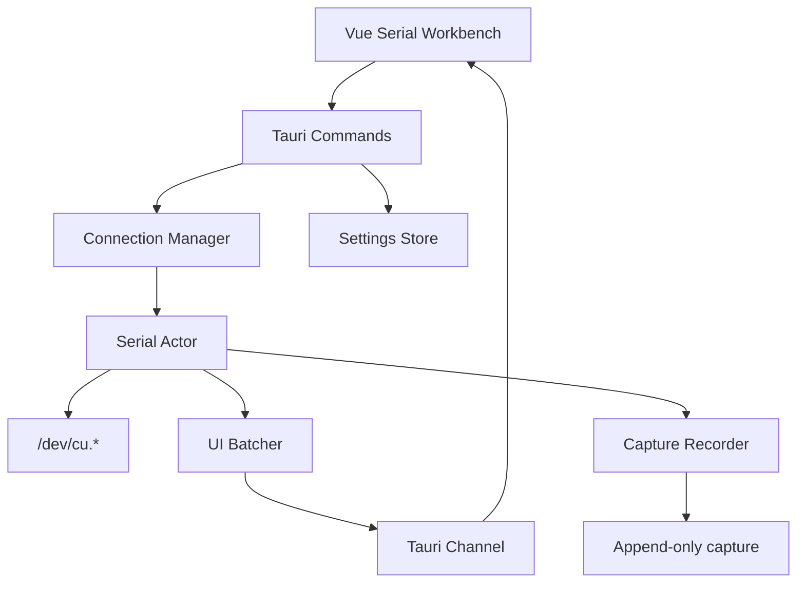
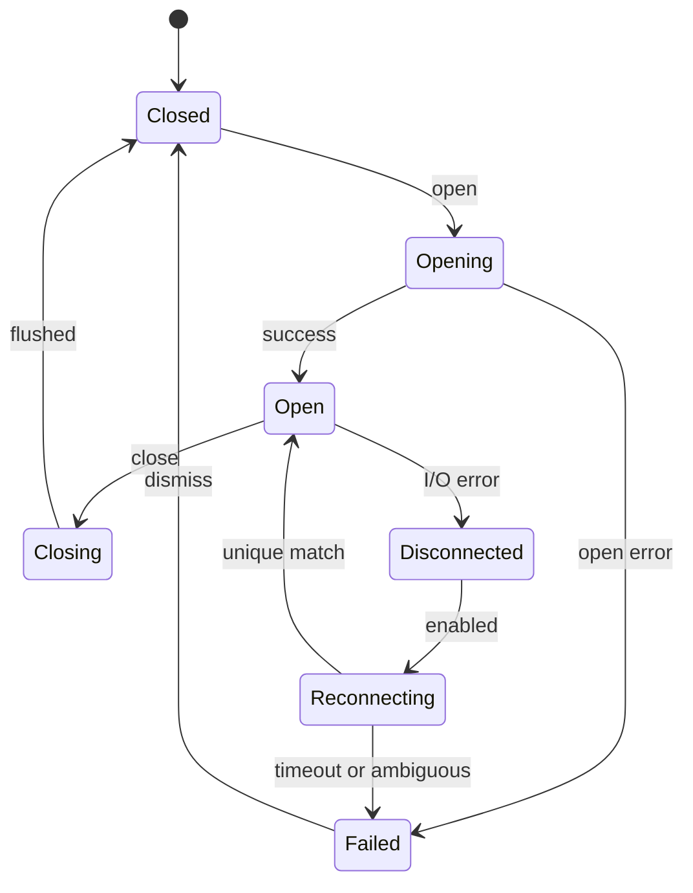
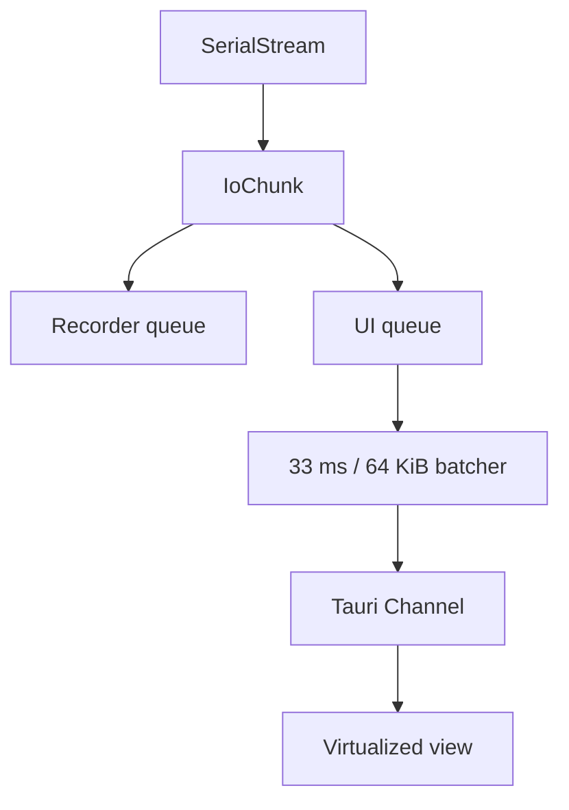

# Mac 串口调试工具：详细设计与实施规格

> 项目代号：Mac Serial Lab   Serial-Lab
> 产品范围：只做 macOS 串口连接、收发、观察、记录与导出  
> 首发平台：macOS 13+ / Apple Silicon arm64  
> 技术栈：Tauri 2 + Vue 3 + TypeScript + Rust + Tokio  
> 文档用途：可以直接建仓、拆任务、编码和验收  
> 版本：1.0 · 2026-08-11

---

## 1. 产品定义

### 1.1 一句话定位

为 Apple Silicon Mac 开发者打造一个稳定、快速、HEX 友好、长时间运行不卡顿的现代串口调试工具。

### 1.2 解决的问题

目标用户在 Mac 上调试 MCU、模组、传感器和其他 USB 串口设备时，经常遇到：

- 工具界面老旧、操作不符合 macOS 习惯。
- 免费工具功能简陋，好用的工具需要订阅或付费。
- 大量串口日志导致界面卡死或内存持续增长。
- 文本、HEX、时间戳、收发方向切换不方便。
- 常用指令不能保存，重复调试效率低。
- 拔插设备后状态不准确，错误原因不清楚。
- 日志导出丢失原始字节、方向或时间信息。

本产品不做综合网络调试平台，只把串口这一件事做深。

### 1.3 用户

- STM32、ESP32、Arduino、RP2040 等嵌入式开发者。
- 调试 AT 指令模组的工程师。
- USB CDC、CH340、CP210x、FTDI 用户。
- 设备测试、生产测试和现场支持人员。

### 1.4 产品原则

1. 原始字节是唯一事实，显示模式不能改变数据。
2. 稳定性优先于功能数量。
3. 所有持续任务都有容量、取消方式和明确终态。
4. UI 可以降级或丢弃展示，后台完整采集不能静默丢失。
5. 错误必须告诉用户发生了什么以及下一步怎么处理。
6. 首版只对 macOS arm64 负责，但平台代码不得散落到业务层。
7. v1.0 UI 和错误信息使用英文，代码注释使用英文。暂不引入国际化框架。

---

## 2. 范围和版本

### 2.1 v0.1：可用内核

- 枚举 `/dev/cu.*`。
- 串口配置和打开/关闭。
- ASCII、UTF-8、HEX 收发。
- CR、LF、CRLF。
- RX/TX 时间戳和方向。
- Tauri Channel 批量推送。
- 有限内存日志窗口。
- 拔出和端口占用错误。
- 清空显示（仅清除前端窗口，不影响后端接收、采集和 sequence）。

### 2.2 v0.2：日常可用

- 虚拟列表。
- 暂停显示但继续接收。
- 搜索、过滤和复制。
- 发送历史与收藏命令。
- 循环发送。
- DTR/RTS。
- 配置记忆。
- 自动重连候选识别。

### 2.3 v0.3：稳定采集

- 二进制原始采集。
- TXT、HEX、CSV 导出。
- 异常退出恢复。
- 磁盘空间保护。
- 8 小时长稳测试。
- CH340、CP210x、FTDI/CDC 真机矩阵。

### 2.4 v1.0：发布版本

- 快捷键和命令面板。
- 暗色/亮色主题。
- 诊断包。
- 应用图标、DMG。
- Developer ID 签名和 notarization。
- 在另一台干净 Apple Silicon Mac 上安装验收。

### 2.5 v1.0 不做

- HTTP、TCP、UDP、WebSocket、MQTT、BLE、CAN。
- Windows、Linux、Intel Mac。
- JavaScript、WASM、本地动态库插件。
- 通用协议描述语言。
- 云同步、账号、协作、支付。
- 固件烧录、编译、厂商 SDK。
- 多串口并排工作台；先把单连接体验做稳。

---

## 3. 非功能指标

| 指标 | v1.0 目标 |
|---|---|
| 冷启动 | 常规 M1 Pro 上 2 秒内可交互 |
| 打开串口 | 正常设备 500 ms 内进入 Open 或返回明确错误 |
| 断线感知 | 下一次 I/O 失败或轮询周期内，目标约 1 秒 |
| UI 刷新 | 默认约 30 FPS，数据按批推送 |
| 显示吞吐 | 模拟持续 1 MiB/s 时 UI 仍能响应关闭和暂停 |
| 内存 | 长会话不随总接收量线性增长 |
| 采集 | 常用速率连续 8 小时，会话可正常关闭和读取 |
| 数据缺口 | UI 和采集缺口均有单独计数或状态 |
| 安装 | DMG 可在另一台 Apple Silicon Mac 安装和运行 |

“1 MiB/s”是软件压力目标，不代表普通 UART 的典型吞吐。它用于给实现留出余量。

---

## 4. macOS 运行环境

### 4.1 开发环境

- macOS 13 或更高。
- Apple Silicon arm64。
- Xcode Command Line Tools。
- Rust stable，使用 `rust-toolchain.toml` 固定。
- Node.js LTS，使用 `.nvmrc` 固定。
- pnpm 和 lockfile。

开发和构建文件放内置 SSD。外接 SSD 只作为可选采集位置，并测试采集中途断开。

### 4.2 串口路径规则

主动连接默认使用：

```text
/dev/cu.usbserial-*
/dev/cu.usbmodem-*
/dev/cu.SLAB_USBtoUART
/dev/cu.wchusbserial-*
```

默认隐藏 `/dev/tty.*`、Bluetooth-Incoming-Port 等与 USB 调试无关的端口。高级选项允许显示全部端口。

#### 端口刷新策略

- 默认每 3 秒轮询一次 `/dev/cu.*`。
- 已连接时仍保持轮询，以便发现新设备或检测当前设备消失。
- UI 提供手动刷新按钮，点击立即执行一次枚举。
- 轮询结果与上次比对，仅在列表变化时推送前端。
- v0.2 可评估 IOKit 设备通知替代轮询。

### 4.3 设备信息

串口库可能只返回部分 USB 信息，所有字段都必须允许为空：

```rust
pub struct SerialPortDescriptor {
    pub path: String,
    pub display_name: String,
    pub port_type: PortTypeDto,
    pub vid: Option<u16>,
    pub pid: Option<u16>,
    pub serial_number: Option<String>,
    pub manufacturer: Option<String>,
    pub product: Option<String>,
    pub is_callout: bool,
    pub reconnect_key: String,
}
```

重连键优先级：

1. VID + PID + USB serial number。
2. VID + PID + location/path 信息。
3. 标准化端口路径。

多个设备匹配时停止自动重连，要求用户选择，禁止猜测。

`display_name` 生成规则（优先级从高到低）：

1. USB `product` 字段存在且非空时直接使用。
2. `manufacturer` + `VID:PID` 格式化显示。
3. 以上均无时 fallback 到端口路径 basename，例如 `usbserial-1420`。

---

## 5. 总体架构



### 5.1 责任边界

前端负责：

- 表单和交互。
- 有限窗口数据展示。
- 输入校验的即时提示。
- 搜索、视觉过滤和复制。
- 根据 Rust 快照渲染连接状态。

Rust 负责：

- 串口句柄唯一所有权。
- 连接状态机。
- 异步读写和任务取消。
- sequence、时间戳和指标。
- UI 数据批处理与背压。
- 完整采集和恢复。
- 文件路径、磁盘和安全校验。

### 5.2 IPC 选择

- Command：枚举、打开、关闭、写入、开始/停止采集等离散意图。
- Channel：连接生命周期内的有序数据、状态和指标。
- Event：只用于低频全局通知，例如系统端口列表变化；v0.1 可以先用定时刷新代替。

普通事件广播不承载持续串口数据。

### 5.3 应用生命周期

#### 5.3.1 Graceful Shutdown

用户关闭窗口或 ⌘Q 退出时，Tauri 拦截关闭事件并按顺序清理：

1. 停止所有循环发送任务。
2. 停止 UI 数据推送。
3. 采集运行中：flush Recorder 队列 → 写入 Footer → 关闭文件。
4. 关闭所有串口连接，释放 `/dev/cu.*` 句柄。
5. 原子写入设置文件。
6. 退出进程。

整个 shutdown 设置 5 秒硬上限。超时强制退出，采集文件按异常退出处理（无 Footer，恢复时扫描最后完整 block）。

```rust
async fn graceful_shutdown(manager: &ConnectionManager, timeout: Duration) {
    let result = tokio::time::timeout(timeout, async {
        manager.close_all(CloseReason::AppShutdown).await;
    }).await;
    if result.is_err() {
        tracing::error!("Shutdown timed out after {:?}", timeout);
    }
}
```

#### 5.3.2 单窗口约束

v1.0 强制单窗口。Tauri 配置禁止创建第二个 webview window。用户通过 Dock 再次激活时聚焦已有窗口。

#### 5.3.3 macOS App Nap 防护

以下任一条件满足时，通过 `NSProcessInfo.beginActivity` 禁用 App Nap：

- 串口连接处于 Open 状态。
- 采集正在运行。
- 循环发送正在执行。

条件全部消失后恢复正常 App Nap。Rust 端通过 `objc2` crate 调用，封装为 RAII `ActivityGuard`：

```rust
pub struct ActivityGuard { /* NSObjectProtocol handle */ }

impl ActivityGuard {
    pub fn new(reason: &str) -> Self { /* beginActivity */ }
}
impl Drop for ActivityGuard {
    fn drop(&mut self) { /* endActivity */ }
}
```

#### 5.3.4 系统睡眠与唤醒

通过 Rust 监听 `NSWorkspace` 通知：

| 事件 | 处理 |
|---|---|
| `willSleepNotification` | 标记连接为 Suspending；采集中 flush 当前 block 并写入 `SleepGap` 记录 |
| `didWakeNotification` | 验证每个串口句柄：成功则恢复，失败则进入 Disconnected |

- 唤醒后必须实际尝试 I/O 确认串口有效，不能仅凭路径存在判断。
- 睡眠期间设备拔出按正常断线处理。
- `SleepGap` 记录携带睡眠时长，导出时标注间隔。

---

## 6. 仓库结构

```text
mac-serial-lab/
├── apps/desktop/
│   ├── src/
│   │   ├── app/
│   │   ├── features/serial/
│   │   │   ├── api/serialApi.ts
│   │   │   ├── components/
│   │   │   ├── composables/useSerialChannel.ts
│   │   │   ├── stores/serialStore.ts
│   │   │   ├── types.ts
│   │   │   └── SerialWorkbench.vue
│   │   ├── features/commands/
│   │   ├── features/capture/
│   │   └── shared/
│   └── src-tauri/
│       ├── capabilities/
│       ├── src/commands/
│       ├── src/app_state.rs
│       ├── src/bootstrap.rs
│       └── tauri.conf.json
├── crates/
│   ├── app-types/
│   ├── serial-core/
│   │   ├── src/actor.rs
│   │   ├── src/manager.rs
│   │   ├── src/ports.rs
│   │   ├── src/batcher.rs
│   │   └── src/transport.rs
│   ├── capture-core/
│   └── settings-store/
├── fixtures/captures/
├── tests/
├── docs/decisions/
├── docs/benchmarks/
├── Cargo.toml
├── package.json
├── pnpm-workspace.yaml
├── rust-toolchain.toml
└── README.md
```

v0.1 可以只有 `app-types` 和 `serial-core` 两个 crate。不要为未来功能预建大量空模块。

---

## 7. Rust 核心类型

### 7.1 基础 ID

```rust
pub type ConnectionId = uuid::Uuid;
pub type OperationId = uuid::Uuid;
pub type CaptureId = uuid::Uuid;
```

端口路径不是连接 ID。一次关闭再打开产生新的 `ConnectionId`。

### 7.2 打开配置

```rust
#[derive(Debug, Clone, Serialize, Deserialize)]
#[serde(rename_all = "camelCase")]
pub struct SerialOpenConfig {
    pub port_path: String,
    pub baud_rate: u32,
    pub data_bits: DataBitsDto,
    pub stop_bits: StopBitsDto,
    pub parity: ParityDto,
    pub flow_control: FlowControlDto,
    pub auto_reconnect: bool,
}
```

校验规则：

- `port_path` 必须来自最近枚举结果或用户明确选择的合法设备路径。
- 默认只允许 `/dev/cu.*`，高级模式才允许其他 `/dev/*`。
- 波特率为正数，并设置合理上限。
- v0.1 在线修改配置采用关闭并重开，不做原地变更。

### 7.3 连接状态

```rust
pub enum ConnectionState {
    Closed,
    Opening,
    Open,
    Closing,
    Disconnected,
    Reconnecting,
    Failed,
}

pub struct ConnectionSnapshot {
    pub connection_id: ConnectionId,
    pub state: ConnectionState,
    pub port: SerialPortDescriptor,
    pub config: SerialOpenConfig,
    pub opened_at_utc_us: Option<i64>,
    pub metrics: SerialMetrics,
    pub capture: Option<CaptureSnapshot>,
    pub last_error: Option<AppError>,
}
```

### 7.4 原始 I/O

```rust
pub enum Direction { Rx, Tx }

pub struct IoChunk {
    pub connection_id: ConnectionId,
    pub sequence: u64,
    pub direction: Direction,
    pub wall_time_utc_us: i64,
    pub monotonic_ns: u64,
    pub payload: bytes::Bytes,
}
```

同一连接的 RX/TX 共用一个 sequence。`wall_time_utc_us` 用于显示，`monotonic_ns` 用于排序和耗时。微秒存储不等于微秒级硬实时准确度。

### 7.5 指标

```rust
pub struct SerialMetrics {
    pub rx_bytes_total: u64,
    pub tx_bytes_total: u64,
    pub rx_bytes_per_second: u64,
    pub tx_bytes_per_second: u64,
    pub ui_queue_depth: usize,
    pub recorder_queue_depth: usize,
    pub dropped_ui_batches: u64,
    pub dropped_ui_bytes: u64,
}
```

---

## 8. ConnectionManager

全局 `ConnectionManager` 存在于 Tauri managed state：

```rust
pub struct ConnectionManager {
    connections: tokio::sync::RwLock<HashMap<ConnectionId, ConnectionHandle>>,
}

pub struct ConnectionHandle {
    pub command_tx: mpsc::Sender<SerialCommand>,
    pub cancel: CancellationToken,
    pub snapshot: watch::Receiver<ConnectionSnapshot>,
}
```

职责：

- 防止同一应用重复打开同一端口。
- 创建 Actor 和通道。
- 转发 write/close/capture 命令。
- 提供快照。
- Actor 结束后清理注册表。

锁规则：

- 不在持有 HashMap 锁时执行串口 I/O 或 await 长任务。
- 从 map 克隆 handle 后立即释放锁。
- close 幂等；重复 close 返回已关闭收据，不产生崩溃。

---

## 9. SerialActor

### 9.1 唯一所有权

每个连接只有一个 Actor 持有 `SerialStream`。不使用多个克隆端口分别修改配置或控制线。

```rust
enum SerialCommand {
    Write {
        operation_id: OperationId,
        payload: Bytes,
        reply: oneshot::Sender<Result<WriteReceipt, AppError>>,
    },
    SetDtr { enabled: bool, reply: Reply<()> },
    SetRts { enabled: bool, reply: Reply<()> },
    StartCapture { options: CaptureOptions, reply: Reply<CaptureInfo> },
    StopCapture { reply: Reply<CaptureSummary> },
    SetUiPaused { paused: bool },
    Close { reason: CloseReason, reply: Reply<()> },
}
```

### 9.2 主循环

```rust
async fn run(mut self) {
    self.publish_state(ConnectionState::Open, None);

    loop {
        tokio::select! {
            _ = self.cancel.cancelled() => {
                self.close_reason = CloseReason::Cancelled;
                break;
            }
            command = self.command_rx.recv() => {
                match command {
                    Some(cmd) => self.handle_command(cmd).await,
                    None => break,
                }
            }
            read = self.port.read_buf(&mut self.read_buffer) => {
                match read {
                    Ok(0) => tokio::task::yield_now().await,
                    Ok(_) => self.handle_rx().await,
                    Err(error) => {
                        self.handle_io_failure(error).await;
                        break;
                    }
                }
            }
        }
    }

    self.finish_capture().await;
    self.publish_terminal_state();
}
```

实施注意：

- 关闭命令必须在高吞吐时仍及时响应。
- 单次写入设置上限，首版默认 1 MiB。
- 写入成功后才产生 TX `IoChunk`；记录实际写入字节数。
- partial write 必须循环完成或返回明确错误。
- 无命令时不能 busy loop。
- Actor panic 不得让 UI 永久停留在 Open；外层 supervisor 发布终态。

### 9.3 状态机



所有状态变化携带：旧状态、新状态、原因码、时间和可选 AppError。

### 9.4 自动重连

v0.2 实现，策略：

1. 断线后不立刻无限重试。
2. 以 500 ms、1 s、2 s、5 s 间隔枚举，之后保持 5 s。
3. 最大自动尝试时间默认 60 s。
4. 唯一匹配 reconnect key 才自动打开。
5. 多候选或配置变化时要求确认。
6. 自动重连前不自动恢复循环发送，默认让用户确认。

---

## 10. 数据批处理与背压

### 10.1 数据路径



### 10.2 初始参数

| 参数 | 默认值 |
|---|---:|
| 读取缓冲 | 32 KiB |
| UI 聚合周期 | 33 ms |
| UI 单批上限 | 64 KiB |
| UI 有界队列 | 64 批 |
| 前端原始窗口预算 | 32 MiB |
| 展示逻辑行上限 | 20,000 行 |
| 指标推送周期 | 500 ms |
| 单次发送上限 | 1 MiB |

这些参数由 P0 benchmark 调整，不视为永久 API。

### 10.3 丢弃策略

- UI 队列满：允许丢展示批次，累计批次数和字节数。
- 暂停显示：停止发送新的 UI 数据；Reader 和 Recorder 继续。
- 恢复显示：从实时位置恢复，不把暂停期间所有数据瞬间灌入 UI。
- 完整采集开启时，Recorder 队列不能静默丢弃。
- Recorder 达到硬上限：停止采集、标记 incomplete、发送严重告警。
- 用户可选择“采集失败后保持串口连接”或“同时断开”，默认保持连接。

### 10.4 Channel 消息

```typescript
type SerialChannelMessage =
  | { type: 'dataBatch'; value: IoBatchDto }
  | { type: 'stateChanged'; value: ConnectionStateChanged }
  | { type: 'metrics'; value: SerialMetrics }
  | { type: 'captureWarning'; value: CaptureWarning }
  | { type: 'terminalError'; value: AppError }
```

不能把 byte 数组编码成 JSON 数字数组。P0 实测 Base64 与二进制 Channel，按 CPU、延迟和内存结果选择。

---

## 11. Tauri Commands

```text
serial_list_ports(options) -> PortListResult
serial_open(config, channel) -> ConnectionInfo
serial_close(connectionId) -> OperationReceipt
serial_get_snapshot(connectionId) -> ConnectionSnapshot
serial_write(connectionId, payload, options) -> WriteReceipt
serial_set_dtr(connectionId, enabled) -> OperationReceipt
serial_set_rts(connectionId, enabled) -> OperationReceipt
serial_set_ui_paused(connectionId, paused) -> OperationReceipt
serial_clear_display(connectionId) -> OperationReceipt
capture_start(connectionId, options) -> CaptureInfo
capture_stop(captureId) -> CaptureSummary
capture_export(captureId, format, destination) -> ExportSummary
settings_get() -> AppSettings
settings_update(patch) -> AppSettings
```

规则：

- Command adapter 只做反序列化、校验、权限检查和 service 调用。
- 每个命令返回稳定 DTO，不暴露 tokio-serial 内部类型。
- 所有可重试错误有稳定 code。
- 大 payload 不放普通 JSON 参数；根据 P0 IPC 结论实现。
- 文件导出路径必须来自系统保存对话框授权。

---

## 12. 前端工作台

### 12.1 布局

```text
┌────────────────────────────────────────────────────────────┐
│ 端口  波特率  数据位  校验  停止位      刷新  连接/断开 │
├───────────────────────────────────────┬────────────────────┤
│                                       │ 显示设置           │
│          虚拟化接收/发送日志          │ Text/HEX/Mixed     │
│                                       │ 时间戳/方向/过滤   │
│                                       │ 会话/采集          │
├───────────────────────────────────────┴────────────────────┤
│ 输入区       Text/HEX  CR/LF  收藏  循环设置       发送  │
├────────────────────────────────────────────────────────────┤
│ Open | RX 12 KB/s | TX 1 KB/s | UI dropped 0 | REC off   │
└────────────────────────────────────────────────────────────┘
```

### 12.2 Pinia 状态

```typescript
interface SerialStoreState {
  ports: SerialPortDescriptor[]
  selectedPortPath?: string
  config: SerialOpenConfig
  connection?: ConnectionSnapshot
  display: DisplaySettings
  metrics: SerialMetrics
  isUiPaused: boolean
  visibleRows: DisplayRow[]
  sendHistory: SendHistoryItem[]
  savedCommands: SavedCommand[]
  lastError?: AppError
  notifications: Notification[]
}

interface Notification {
  id: string
  level: 'info' | 'warning' | 'error'
  code?: string
  message: string
  dismissable: boolean
  createdAt: number
  autoDismissMs?: number
}
```

Pinia 不保存 Channel 对象、取消函数、串口句柄或完整采集数据。Channel 生命周期由 `useSerialChannel()` 管理。

### 12.3 前端重新加载

- 页面卸载时注销 Channel 回调。
- Rust 检测消费者消失后停止非必要 UI 推送。
- 页面重新加载后调用 `serial_get_snapshot()`。
- 不能根据按钮旧颜色推断串口仍连接。
- 若完整采集仍运行，重新订阅后显示真实状态。

### 12.4 虚拟列表

- 使用成熟虚拟滚动库（如 `vue-virtual-scroller`）或基于 `IntersectionObserver` 自实现。不自造滚动物理引擎。
- Text 模式固定行高，HEX 模式固定行高（可与 Text 不同），Mixed 模式取 HEX 行高。
- 自动滚动策略：
  - 默认启用自动滚动到底部。
  - 用户向上滚动超过一屏后暂停 auto-scroll，底部出现“回到最新”按钮。
  - 点击按钮或手动滚到底部恢复 auto-scroll。
- 搜索跳转：命中结果通过 `scrollToIndex` 定位，高亮匹配行并短暂闪烁。
- 20,000 行上限达到后裁剪最旧行，裁剪计数显示在状态栏。

### 12.5 核心快捷键

v1.0 必须实现的快捷键：

| 操作 | macOS 快捷键 |
|---|---|
| 连接 / 断开串口 | ⌘D |
| 清空显示 | ⌘K |
| 发送当前输入 | ⌘Enter |
| 暂停 / 恢复显示 | ⌘P |
| 搜索日志 | ⌘F |
| 切换 Text 模式 | ⌘1 |
| 切换 HEX 模式 | ⌘2 |
| 切换 Mixed 模式 | ⌘3 |
| 开始 / 停止采集 | ⌘R |
| 聚焦发送输入框 | ⌘L |
| 刷新端口列表 | ⌘⇧R |

快捷键通过 Tauri global shortcut 或 Vue `@keydown` 注册。避免与 macOS 系统快捷键冲突。所有快捷键在 UI 中有 tooltip 提示。

---

## 13. 显示和编码

### 13.1 DisplayRow

```typescript
interface DisplayRow {
  id: string
  sequenceStart: bigint
  sequenceEnd: bigint
  direction: 'rx' | 'tx'
  timestampUs: bigint
  monotonicNs: bigint
  text: string
  byteLength: number
  decodeError: boolean
}
```

### 13.2 Text 模式

- 使用流式 `TextDecoder`，保留跨 chunk 的不完整 UTF-8 序列。
- CR、LF、CRLF 分行必须处理分隔符跨 chunk。
- 非法 UTF-8 使用替换符显示，但原始 bytes 不变。
- 长时间没有换行时，对单行显示长度设置上限，视觉上拆行但不修改数据。

### 13.3 HEX 模式

- 每行 16 或 32 bytes。
- 显示 offset、HEX、ASCII。
- 选择字节时三栏同步高亮。
- 复制格式：纯 HEX、空格 HEX、C 数组、Rust 数组、Base64。
- offset 默认按当前连接累计 RX/TX 分别计算；混合时同时展示 sequence。

### 13.4 Mixed 模式

首版同一行显示时间、方向、HEX 和 ASCII。

视觉设计：

- RX 使用绿色文字（`#22C55E`），TX 使用蓝色文字（`#3B82F6`）。
- 每行开头显示方向标签 `← RX` 或 `→ TX`。
- 时间戳位于行首，方向标签紧随其后。
- 同一方向的连续数据合并显示；方向切换时插入视觉分隔（细线或间距）。
- 按 `sequence` 排序，相同时间的不同方向数据按到达顺序排列。
- 不做复杂协议树。

---

## 14. 发送系统

### 14.1 输入模式

- Text：UTF-8 编码。
- HEX：解析为 bytes。
- 结尾：None、CR、LF、CRLF。
- Text 模式允许多行；发送前显示字节数。

### 14.2 HEX 解析

接受：

```text
AA 55 01 02
AA550102
0xAA, 0x55, 0x01, 0x02
```

拒绝并精确定位：

- 奇数个 HEX 字符。
- 非法字符。
- 不完整 `0x`。
- 空 token。
- 超过 1 MiB。

解析器放 Rust core，并在 TypeScript 实现轻量即时校验；最终以 Rust 结果为准，两端用同一 fixtures 验证。

### 14.3 发送历史

记录：输入原文、解析模式、追加结尾、发送时间、字节数、是否成功。默认保留最近 100 条，重复项移动到顶部。

### 14.4 收藏命令

```typescript
interface SavedCommand {
  id: string
  name: string
  payloadText: string
  mode: 'text' | 'hex'
  lineEnding: 'none' | 'cr' | 'lf' | 'crlf'
  shortcut?: string
  color?: string
}
```

导入导出使用版本化 JSON，首版不包含脚本。

### 14.5 循环发送

```rust
pub struct RepeatSendSpec {
    pub payload: Bytes,
    pub interval_ms: u64,
    pub repeat_count: Option<u64>,
    pub stop_on_write_error: bool,
}
```

规则：

- 最小间隔默认 10 ms，高风险参数需要明显提示。
- 同一连接只能有一个循环任务。
- 断线、关闭或 payload 修改时停止。
- 自动重连后默认不自动恢复。
- 使用单调时钟调度，避免系统时间变化。
- 如果发送耗时超过间隔，不积压无限任务；采用 skip 或 delay 策略并显示 missed count。
- 循环发送期间允许手动发送。手动发送的数据使用独立 sequence，与循环任务的数据在 IoChunk 流中按实际时间交错。不需要暂停循环发送才能手动发送。

---

## 15. 采集和文件格式

### 15.1 数据目录

通过系统 API 获取：

```text
~/Library/Application Support/<bundle-id>/
├── settings.json
├── captures/
├── logs/
├── temp/
└── recovery/
```

不要硬编码用户目录。首版设置、发送历史和收藏命令可以使用版本化 JSON；不必引入 SQLite。

### 15.2 为什么首版不需要 SQLite

该产品首版只有单连接、少量配置和顺序采集文件：

- 设置和收藏适合小型 JSON。
- 原始数据适合 append-only 文件。
- 会话列表可以扫描小型 metadata 文件。

只有未来需要跨大量会话全文查询或消息级随机索引时才引入 SQLite。

### 15.3 Capture v1

```text
FileHeader
BlockHeader + Record... + BlockCRC
BlockHeader + Record... + BlockCRC
...
Footer（正常关闭时）
```

文件头：

```text
magic                  8 bytes
format_version          u16 little-endian
header_length           u16
capture_uuid            16 bytes
connection_uuid         16 bytes
created_wall_time_us    i64
monotonic_anchor_ns     u64
metadata_length         u32
metadata_json           bytes
```

记录：

```text
record_length           u32
record_type             u8
direction               u8
flags                   u16
sequence                u64
wall_time_delta_us      i64
monotonic_delta_ns      u64
payload_length          u32
payload                 bytes
```

实现要求：

- 固定 little-endian。
- 解码时先校验长度上限再分配。
- block 建议 1～4 MiB 或最多 1 秒完成一次。
- block 级 CRC32C。
- 正常关闭写 footer；异常退出没有 footer。
- 恢复扫描到最后一个完整且 CRC 正确的 block。
- 损坏尾部不影响之前完整 block。
- 恢复后标记 `recovered/incomplete`。

### 15.4 Recorder 策略

- Reader 到 Recorder 使用有界队列。
- 70% 高水位发送警告。
- 100% 或写盘失败立即停止采集。
- 开始采集前检查剩余空间。
- 采集中定期复查空间。
- 默认至少保留 1 GiB 或用户配置的安全余量。
- 采集失败默认不断开串口。

### 15.5 采集文件命名与会话管理

文件命名格式：

```text
{capture_id_short}_{port_basename}_{start_time}.slab
```

示例：`a1b2c3d4_usbserial-1420_20260811T143052.slab`

- `capture_id_short` 取 UUID 前 8 位。
- `port_basename` 取端口路径最后一段。
- `start_time` 使用 ISO 8601 紧凑格式，本地时间。
- 扩展名 `.slab`（Serial Lab Binary）。

会话管理：

- UI 提供历史采集列表，扫描 `captures/` 目录下的文件头获取元信息（端口、时间、大小、是否完整）。
- 支持用户自定义采集保存路径（通过系统目录选择对话框）。
- 不做自动清理。提供手动删除按钮，删除前确认。
- 文件元数据缓存在内存，避免每次打开列表都扫描文件头。

### 15.6 导出

格式：

- Raw：纯 payload，可选择 RX、TX 或按时序混合。
- TXT：时间、方向、文本。
- HEX：时间、方向、offset、HEX、ASCII。
- CSV：timestamp、direction、sequence、length、hex、text_preview。

导出必须流式读取采集文件，不能一次加载整个会话。导出 metadata 说明会话是否完整及缺口信息。

---

## 16. 设置持久化

```json
{
  "schemaVersion": 1,
  "theme": "system",
  "lastSerialConfig": {
    "baudRate": 115200,
    "dataBits": "eight",
    "stopBits": "one",
    "parity": "none",
    "flowControl": "none"
  },
  "display": {
    "mode": "mixed",
    "showTimestamp": true,
    "autoScroll": true,
    "hexColumns": 16
  },
  "capture": {
    "minimumFreeSpaceBytes": 1073741824
  }
}
```

- 写入临时文件后原子替换。
- schemaVersion 必须存在。
- 损坏配置移到 recovery 并恢复默认值，不能阻止程序启动。
- 不保存系统串口句柄或“仍连接”状态。

---

## 17. 错误模型

```rust
pub struct AppError {
    pub code: ErrorCode,
    pub message: String,
    pub detail: Option<String>,
    pub recoverable: bool,
    pub suggested_action: Option<String>,
    pub context: serde_json::Value,
    pub cause_chain: Vec<String>,
}
```

首版错误码：

| code | 用户建议 |
|---|---|
| SERIAL_PORT_NOT_FOUND | 重新插入设备并刷新端口 |
| SERIAL_PORT_BUSY | 关闭其他串口工具后重试 |
| SERIAL_PERMISSION_DENIED | 检查驱动和应用权限 |
| SERIAL_INVALID_CONFIG | 修改标出的串口参数 |
| SERIAL_OPEN_FAILED | 复制诊断信息并重试 |
| SERIAL_DISCONNECTED | 检查 USB 连接或选择重连 |
| SERIAL_READ_FAILED | 检查设备和驱动 |
| SERIAL_WRITE_FAILED | 检查连接状态并重试 |
| SERIAL_INVALID_HEX | 修正高亮的输入位置 |
| SERIAL_PAYLOAD_TOO_LARGE | 缩小单次发送数据 |
| CAPTURE_DISK_LOW | 释放空间或更换保存位置 |
| CAPTURE_WRITE_FAILED | 检查磁盘连接和权限 |
| CAPTURE_INCOMPLETE | 数据只完整到标出的 sequence |
| EXPORT_FAILED | 检查目标路径和剩余空间 |
| TASK_CANCELLED | 操作已由用户取消 |
| INTERNAL_PANIC | 复制诊断信息并重启应用 |

UI 只能根据 code 决定操作，禁止匹配中文 message。

---

## 18. 安全和权限

- Tauri capability 只开放实际 commands、dialog 和必要路径 API。
- 禁止任意 shell 执行。
- 导出必须使用系统保存对话框。
- Rust 端验证路径、文件大小和状态，不信任前端。
- 导入收藏命令时限制文件大小、JSON 深度、字符串长度和条目数量。
- 诊断日志默认不记录完整串口 payload；用户显式开启 TRACE 才记录有限预览。
- 首版采用 Developer ID 直接分发，不以 Mac App Store sandbox 为目标。

---

## 19. 日志与诊断

### 19.1 日志框架

使用 `tracing` + `tracing-subscriber`：

- 默认日志级别：`INFO`。
- 环境变量 `SERIAL_LAB_LOG` 覆盖级别，支持模块粒度（如 `serial_core=debug,capture_core=trace`）。
- 串口数据不记入日志；仅在 `TRACE` 级别记录每个 IoChunk 的前 32 字节预览。
- 状态机迁移、连接打开/关闭、采集开始/停止记录为 `INFO`。
- 错误和异常记录为 `WARN` 或 `ERROR`，携带完整 cause chain。

### 19.2 日志文件

- 写入 `~/Library/Application Support/<bundle-id>/logs/`。
- 使用 `tracing-appender` 按日轮转（daily rotation）。
- 保留最近 7 天日志，超出自动删除。
- 单个日志文件上限 50 MiB，超出后截断并开始新文件。
- 日志总磁盘占用不超过 200 MiB。

### 19.3 诊断包

v1.0 的“导出诊断信息”功能打包以下内容为 ZIP：

| 内容 | 说明 |
|---|---|
| 最近 3 天日志文件 | 自动脱敏：截断串口数据预览 |
| 系统信息 | macOS 版本、芯片、内存、应用版本 |
| USB 设备列表 | `system_profiler SPUSBDataType` 输出 |
| 当前连接快照 | ConnectionSnapshot 的 JSON 序列化 |
| 采集元数据 | 最近 5 个采集文件的头信息（不含数据） |
| 配置文件 | settings.json 副本 |

诊断包通过系统保存对话框导出，不自动上传。

---

## 20. 测试设计

### 20.1 Transport 抽象

```rust
#[async_trait]
pub trait SerialTransport: AsyncRead + AsyncWrite + Unpin + Send {
    async fn set_dtr(&mut self, enabled: bool) -> io::Result<()>;
    async fn set_rts(&mut self, enabled: bool) -> io::Result<()>;
}
```

生产实现包装 tokio-serial；测试实现使用内存 duplex 或 PTY。不要让状态机测试依赖真实 USB。

### 20.2 Rust 单元测试

- 连接状态合法和非法迁移。
- HEX 多种格式和错误位置。
- UTF-8 跨 chunk。
- CR/LF 跨 chunk。
- batch 按时间和大小 flush。
- UI 队列满时计数。
- partial write。
- close 幂等。
- 循环发送取消和 missed tick。
- capture 编码/解码 round-trip。
- 截断 block、错误 CRC、超大长度攻击。
- 配置损坏恢复。

### 20.3 Property-based 测试

- 任意 bytes 经 capture 编解码保持一致。
- 任意 chunk 分割不改变文本流解码结果。
- 任意损坏文件不会 panic 或无限分配。
- 任意 HEX 空白和分隔组合满足规范。

### 20.4 前端测试

- 端口和配置表单校验。
- Channel 消息顺序应用。
- snapshot 覆盖过期 UI 状态。
- 暂停/恢复不重复显示旧批次。
- 虚拟列表裁剪。
- 搜索和过滤不修改底层原始窗口。
- 发送历史去重。

### 20.5 真机矩阵

至少准备 CP210x 和 CH340，条件允许再加 FTDI 或 CDC：

| 场景 | 验收结果 |
|---|---|
| 打开关闭 100 次 | 无崩溃、无残留占用 |
| 被其他程序占用 | SERIAL_PORT_BUSY |
| 连接中拔出 | 进入 Disconnected |
| 快速重插 | 列表更新，唯一设备可恢复 |
| 同型号两个设备 | 不错误自动重连 |
| 睡眠唤醒 | 最终状态与设备一致 |
| 1 MiB/s 模拟 30 分钟 | UI 可操作、内存稳定 |
| 常用速率采集 8 小时 | 可关闭、恢复和导出 |
| 外接 SSD 采集中拔出 | capture incomplete，应用不崩溃 |
| 磁盘空间不足 | 主动停止采集并告警 |

### 20.6 性能记录

记录到 `docs/benchmarks/mac-m1-pro.md`：

- bytes/s。
- CPU。
- 进程 RSS。
- UI batches/s。
- queue depth。
- dropped UI bytes。
- visible rows。
- 关闭命令最大响应时间。

---

## 21. 开发计划

### P0：技术验证，5～10 个工作日

任务：

1. 创建 Tauri/Vue/Rust workspace。
2. 枚举 `/dev/cu.*`。
3. 打开真实 USB 串口。
4. 实现最小 SerialActor。
5. 实现 read、write、close。
6. 使用 Tauri Channel 推送。
7. 创建内存/PTY 压力源。
8. 对比 32/64/128 KiB batch。
9. 对比 Base64 与二进制传输。
10. 写 benchmark 结论。

退出：真实设备收发成功；模拟 1 MiB/s 运行 30 分钟；关闭及时；IPC 方案定稿。

### P1：v0.1，10～15 个工作日

任务：状态机、配置表单、Text/HEX、时间戳、方向、有限窗口、基础错误、端口刷新。

退出：可以替代最基础串口助手，完成日常收发。

### P2：v0.2，10～15 个工作日

任务：虚拟列表、暂停、搜索、复制、历史、收藏、循环发送、DTR/RTS、配置持久化、自动重连。

退出：日常使用效率明显优于基础免费工具。

### P3：v0.3，10～15 个工作日

任务：capture v1、恢复、导出、磁盘保护、真机矩阵、8 小时长稳。

退出：长时间采集有明确完整性语义，失败不静默。

### P4：v1.0，10 个工作日左右

任务：视觉与快捷键、诊断、图标、DMG、签名、公证、干净机器安装。

退出：可发给其他 Apple Silicon Mac 用户安装。

单人全职总体约 2～3 个月；边学习边开发建议按 3～5 个月规划。2～4 周应能得到自己可用的早期版本。

---

## 22. 第一周逐日实施

### Day 1

- 安装并固定 Rust、Node、pnpm。
- 建 Tauri 2 + Vue 3 项目。
- 配置 fmt、clippy、ESLint、Vitest。
- 空窗口启动。

验收：`pnpm tauri dev` 稳定启动。

### Day 2

- 定义 app-types。
- 实现 `serial_list_ports`。
- 默认过滤 `/dev/cu.*`。
- 页面显示端口和可选 USB 信息。

验收：插拔设备后手动刷新正确。

### Day 3

- 实现 ConnectionManager。
- 定义 SerialActor command。
- 实现 open、snapshot、close。
- 映射端口占用和不存在错误。

验收：打开关闭 50 次，无残留占用。

### Day 4

- 实现 read/write。
- 加 sequence 和双时间戳。
- 接 Tauri Channel。
- 页面显示原始 RX/TX。

验收：真实设备或回环双向收发。

### Day 5

- 实现 33 ms/64 KiB batcher。
- 前端有限窗口。
- 指标：速率、队列、丢弃。
- 实现暂停显示。

验收：持续输入时仍能及时暂停和关闭。

### Day 6～7

- 建内存或 PTY 测试 transport。
- 跑吞吐和内存对比。
- 测试页面刷新、窗口关闭和设备拔出。
- 记录技术决策和已知问题。

验收：P0 关键风险清楚，不带未知架构问题进入 UI 开发。

---

## 23. Definition of Done

一个任务只有同时满足以下条件才完成：

- Rust/TypeScript 编译通过。
- `cargo fmt --check` 和 clippy 通过。
- 前端 lint、单测通过。
- CI 流水线全部绿色（`cargo check + clippy + test` + `pnpm lint + test`）。
- 成功路径与主要失败路径都有测试。
- 新增长任务可取消并有唯一终态。
- 新增队列明确容量、满载行为和指标。
- 新增文件写入处理磁盘满、权限和中途断开。
- 跨 IPC DTO 不暴露内部库类型。
- UI 不匹配中文错误文本。
- 真机功能在 Apple Silicon Mac 验证。
- 不让长会话数据永久堆积在响应式数组。

---

## 24. v1.0 验收清单

- [ ] macOS arm64 构建、安装、启动和卸载正常。
- [ ] `/dev/cu.*` 枚举正确，隐藏无关端口。
- [ ] 常用串口参数有效。
- [ ] Text、HEX、Mixed 收发正确。
- [ ] UTF-8 和换行跨 chunk 正确。
- [ ] 非法 HEX 精确提示位置。
- [ ] 拔出、占用、权限错误清楚。
- [ ] 暂停显示不停止接收和采集。
- [ ] 清空显示不影响后端采集和 sequence。
- [ ] UI 丢弃有计数。
- [ ] 搜索、复制、收藏和循环发送可用。
- [ ] 核心快捷键全部可用。
- [ ] 8 小时采集通过。
- [ ] 异常退出后的完整 block 可恢复。
- [ ] 磁盘满或断开不会静默丢失。
- [ ] TXT、HEX、CSV、raw 导出可用。
- [ ] Graceful shutdown 正确关闭串口并写入采集 Footer。
- [ ] 睡眠唤醒后连接状态与设备一致。
- [ ] App Nap 不影响后台采集。
- [ ] 诊断日志不会默认记录完整 payload。
- [ ] 诊断包可导出并包含完整信息。
- [ ] Developer ID 签名和 notarization 通过。
- [ ] 另一台干净 Apple Silicon Mac 可安装运行。

---

## 25. 后续扩展判断标准

v1.0 之后只根据真实用户数据扩展：

- 多串口：至少 20% 活跃用户明确需要。
- 协议解析：用户重复手工解析同一种帧。
- 自动响应：测试人员大量执行收到 A 后发送 B。
- 波形图：大量用户观察连续数值字段。
- Windows：Mac 版本稳定且有明确跨平台需求。

每个扩展必须先回答：是否会影响 SerialActor、采集格式、长稳性能或简单体验。不能因为功能看起来专业就加入。

---

## 26. 最终执行顺序

```text
真实 Mac 串口收发
→ 单 Actor 和 Channel 压力验证
→ Text/HEX 日常终端
→ 收藏命令和循环发送
→ 可恢复的长时间采集
→ 签名、公证和 DMG 发布
```

这个产品最重要的资产不是功能数量，而是四件事：稳定的连接状态、顺畅的大日志显示、优秀的 HEX/命令操作、可信的数据采集。只要这四件事做好，即使 v1.0 完全没有协议插件和网络调试，它仍然是一款有明确价值的 Mac 串口工具。
