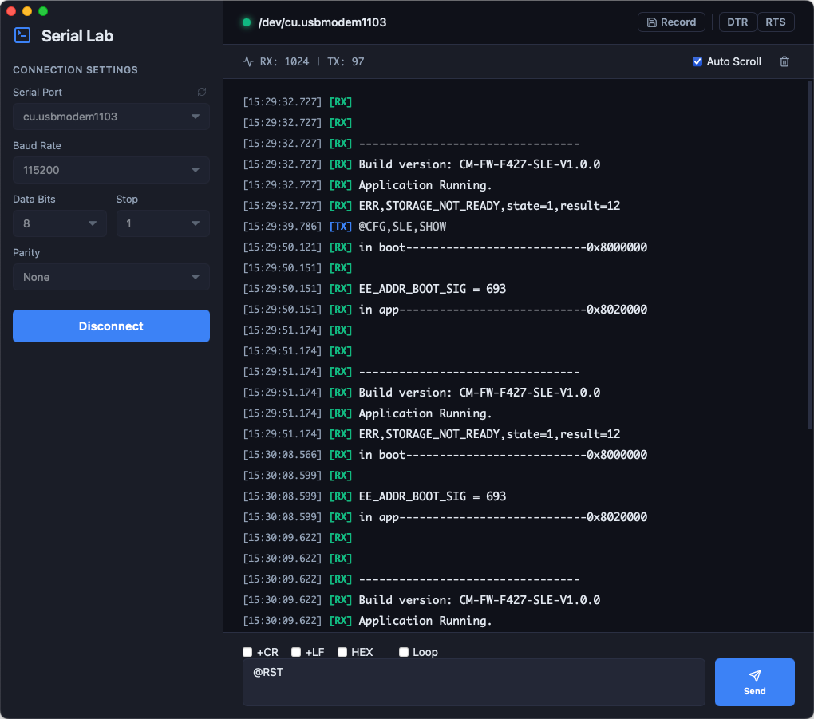

# Serial Lab 🔬

**Serial Lab** is a high-performance, native macOS serial port debugging tool built specifically for developers and hardware engineers. It combines the blazing-fast execution of a **Rust** backend with the fluid, modern interface of **Vue 3 + Tauri v2**.

<p align="center">
  
</p>

## ✨ Features
- **Native macOS Experience:** Beautiful dark mode interface, borderless immersive window, and tailored visual aesthetics.
- **High-Performance Terminal:** Engineered to handle massive hardware data throughput using a memory-safe virtual scrolling engine.
- **Smart Device Discovery:** Automatically detects and filters valid physical serial interfaces (e.g. `/dev/cu.*`).
- **Precision Hardware Control:** Real-time hardware toggles for **DTR** (Data Terminal Ready) and **RTS** (Request To Send).
- **Pro-Level Transmissions:** 
  - Send and receive in HEX or ASCII modes.
  - Granular control over line endings (`+CR`, `+LF`).
  - Automated Loop Send with exact millisecond precision.
  - Quick-access Send History using keyboard navigation (`↑` / `↓`).
- **Zero-Loss Data Logging:** Stream incoming serial data directly to your disk (`.slab` or `.log`) with zero UI rendering overhead, perfect for long-term stress testing.
- **Structured Chronology:** Every byte transmitted or received is precision-timestamped with TX/RX directions for rigorous debugging.

## 🛠 Tech Stack
- **Core Kernel:** Rust (`tokio-serial`, `tokio`)
- **App Framework:** Tauri v2
- **Frontend Engine:** Vue 3 (Composition API), Vite, TypeScript, pnpm workspace

## 🚀 Getting Started

### Prerequisites
- [Node.js](https://nodejs.org/) & [pnpm](https://pnpm.io/)
- [Rust](https://www.rust-lang.org/tools/install)
- macOS (Apple Silicon or Intel)

### Local Development
1. Clone the repository:
   ```bash
   git clone https://github.com/dylan-619/Serial-Lab.git
   cd Serial-Lab
   ```
2. Install dependencies via Cargo and pnpm:
   ```bash
   pnpm install
   ```
3. Start the development environment (Hot-reload for both Vue and Rust):
   ```bash
   pnpm dev
   ```

### Packaging for Release
To build the standalone macOS `.dmg` installation package:
```bash
pnpm -F desktop tauri build
```
You can find the generated installer inside `target/release/bundle/dmg/`.

---
*Built with passion for flawless hardware debugging.*
