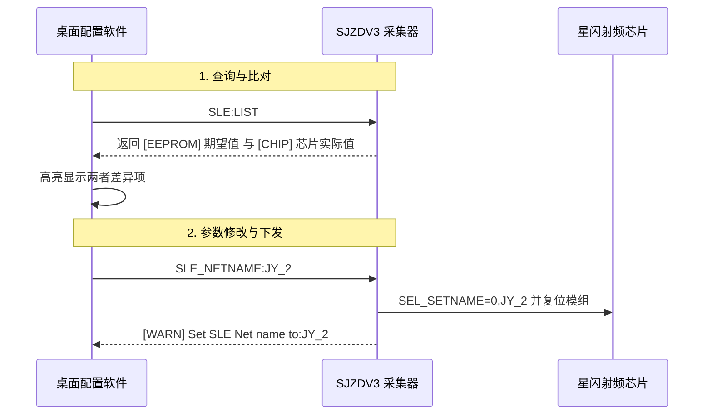
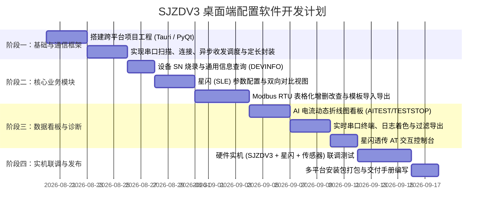

# SJZDV3 星闪现场设备桌面端配置与调试工具 — 需求规格说明书

## 1. 项目背景与建设目标

### 1.1 背景
当前 SJZDV3 星闪现场采集终端的配置、点位录入与硬件调试主要依赖控制台 ASCII 指令及基于 Python 的命令行脚本 [`tools/sjzd_cli.py`](file:///Users/Dylan/work_project/new-yunteng/iot-project/SJZDV3/tools/sjzd_cli.py)。在生产产线烧录、工程现场开通与维保排查时，纯字符界面（CLI）存在以下痛点：
* **门槛较高**：现场调试人员需记忆大量指令格式（如 `RS485DEV:1,3,40002,2,5,1...`），容易产生格式错漏；
* **缺乏图形化可视化**：4~20mA 模拟量采集、多点位 Modbus 解析值及星闪通信状态无法直观通过图表或仪表盘呈现；
* **点位批量维护繁琐**：多达 16 个点位在命令行中以长字符串输入，不易进行单点增删改查及模板导入导出。

### 1.2 目标
开发一款**轻量、跨平台（Windows / macOS）、即开即用**的桌面端 GUI 调试与配置软件，完整封装并升华 `sjzd_cli.py` 的所有底层通信能力，实现：
1. **零代码门槛**：表单化录入、下拉选择、智能校验与错误预警；
2. **点位可视化管理**：表格化增删改查、模板 JSON/CSV 导入导出；
3. **实时数据看板**：AI 电流环动态折线图、Modbus 解析值实时刷新；
4. **一键式诊断维护**：星闪芯片状态双向比对、透传交互面板、日志过滤与导出。

---

## 2. 总体系统架构与通信模型

```mermaid
flowchart TD
    subgraph UI[桌面端 GUI 交互层]
        View1[设备生产与 SN 烧录]
        View2[星闪 (SLE) 参数配置]
        View3[Modbus 点位表格化管理]
        View4[实时数据与硬件监测看板]
        View5[系统维护与 EEPROM 工具]
        View6[串口日志监视与过滤分析]
    end

    subgraph Core[桌面端业务逻辑核心]
        Validator[参数智能校验与纠错引擎]
        Encoder[SJZDV3 严格定长指令编码器]
        Parser[回包提取与协议解析状态机]
        TemplateMgr[点位配置模板导入/导出]
    end

    subgraph Comm[底层通信适配层]
        SerialMgr[跨平台串口驱动 (115200 8N1)]
        Worker[异步收发线程 / 缓冲区管理]
    end

    subgraph HW[SJZDV3 现场设备 (USART1)]
        MCU[STM32F412RET6]
        WLAN[星闪 SLE 模组]
        MB[RS485 Modbus 从站]
    end

    UI <--> Core
    Core <--> Comm
    Comm <--> HW
```

---

## 2.1 当前固件接口适配状态（2026-09-05）

> 本节是对下方早期功能规划的现行协议覆盖说明。SJZDV3 固件已补齐结构化控制台接口；工具侧不得再根据旧版 `[EEPROM]`、`[CHIP]`、`saved` 或普通调试日志推断成功。

| 场景 | 固件现行契约 | NP-Tools 当前判定 |
|---|---|---|
| 配置读取 | `SLE_CONFIG`、`4G_CONFIG`、`RS485_CONFIG` 均使用 `BEGIN/payload/END`，带 `id`、version、revision、count、CRC32 | 只在同一事务 ID、payload 数量和 CRC32 通过后更新页面；`END status=ERROR` 表示读取完整，但配置或运行条件不满足 |
| 保存 | `<FEATURE>_CONFIG:SAVED,revision,hash,status,restart` | 先校验保存回执，再完整 LIST，并要求 `revision` 一致；不会把单条旧日志标记为 EEPROM 已确认 |
| 星闪透传 | `SLE_BRIDGE:ACK` 和透传状态查询 `SLE_BRIDGE:LIST` | ACK 是唯一实时状态来源；状态未知先查询；透传 active 时禁止下发 MCU 配置、查询和诊断命令，AT 指令仅在 ACK 确认透传后可发 |
| Modbus 单点诊断 | `MB_DEBUG:BEGIN/TX/RX/DATA/RESULT/END` | 成功必须有同一 ID 的全部证据；异常、超时、CRC/I/O 错、缺 END 或其他 ID 均不会显示为成功 |
| 4G 密码 | `4G_CONFIG:IDENTITY` 仅回传 `password=set/empty` | 不保存或显示密码明文；写后仅复核“已设置/未设置”状态 |

工具侧已经执行主机协议自测（CRC32、截断/损坏列表、错误终态、保存回执、桥接、Modbus 事务）和构建检查；尚未完成目标板 UART trace、SLE/4G/RS485 链路、掉电保持和 HIL 验证，不能将主机自测描述为实板通过。

---

## 3. 功能需求规格说明

### 模块一：串口连接与通信管理 (Connection Manager)

| 功能项 | 优先级 | 功能描述与技术要求 |
|---|:---:|---|
| **串口自动扫描** | P0 | 启动或点击刷新时自动枚举系统可用串口列表（含端口号与设备厂商描述），支持 USB-TTL 模块热插拔自动识别。 |
| **通信参数设置** | P0 | 默认波特率 `115200`，数据位 `8`，校验位 `None`，停止位 `1`，流控 `None`。支持选择备用波特率（如 9600、230400）。 |
| **连接状态管理** | P0 | 提供明确的连接/断开按钮及状态指示灯（未连接/已连接/通信超时），异常断开时弹出告警并释放资源。 |
| **通信超时与重发机制** | P1 | 发送指令后开启异步等待（默认 `800ms`），未收到回包时提示“无响应或设备已重启”，禁止 UI 线程被阻塞。 |

---

### 模块二：设备基础信息与 SN 烧录 (Device Provisioning)

| 功能项 | 对应底层指令 | 校验规则与交互逻辑 |
|---|---|---|
| **设备信息查询** | `DEVINFO` | 连上串口后可一键查询或自动查询，解析并展示：设备 SN、硬件版本号、固件应用版本、开机次数、累计运行时间。 |
| **12 位 SN 烧录** | `SN:4301xxxxxxxx` | 1. 输入框强制校验**必须为 12 位纯数字**，且**必须以 `4301` 开头**；<br>2. 弹出高危操作二次确认对话框：“写入后设备将自动复位重启”；<br>3. 严格定长编码（不附加尾随 `\r\n`，确保总长度为 15 字节）。 |

---

### 模块三：星闪 (SLE) 无线网络配置 (NearLink / SLE Config)



| 功能项 | 对应底层指令 | UI 控件与交互规范 |
|---|---|---|
| **配置读取与双向比对** | `SLE:LIST` / `SLE_INFO` | 采用对比表格同时呈现 **EEPROM 设定值** 与 **星闪芯片底层回读值**（网络名、名称长度、工作模式、MAC 地址、短地址、发射功率）。差异项用黄色/红色高亮提示。 |
| **网络名称设置** | `SLE_NETNAME:<name>` | 单行文本框，限制 1~16 字符 ASCII（自动过滤空格换行），支持设置名称（如 `JY_2`）。 |
| **AP ID 设置** | `SLE_APID:<id>` | 数字微调框（`0 ~ 255`），默认 `1`。 |
| **发射功率等级** | `SLE_PWR:<1..8>` | 下拉选择框，显示档位及对应实际功率：<br>`1 (-6dBm)`, `2 (-2dBm)`, `3 (+2dBm)`, `4 (+6dBm)`, `5 (+10dBm)`, `6 (+14dBm)`, `7 (+16dBm)`, `8 (+20dBm)`。 |
| **最大发射功率** | `SLE_MAXPWR:<1..8>` | 下拉选择框（1~8 档位），用于限制模组最大射频输出。 |
| **星闪透传调试面板** | `@WLAN=1` / `@WLAN=0` | 提供独立 Switch 开关：开启后激活“AT 指令小终端”，允许高级调试人员直接发送 `SEL_GETNAME?`、`SEL_GETADDR?`、`SEL_RST` 等原厂 AT 指令并实时查看文本响应。 |

---

### 模块四：Modbus RTU 扩展从站管理 (Modbus Manager)

#### 4.1 表格化点位维护界面
支持最多 **16 个点位**，以响应式数据表格（Data Grid）呈现：

| 从站地址 (1~247) | 功能码 | PLC 寄存器地址 (1~65535) | 读取长度 (1~31) | 数据类型 (DataType) | 字节序 (ByteOrder) | 操作 |
|:---:|:---:|:---:|:---:|:---:|:---:|:---:|
| `1` | `03H 保持寄存器` | `40002` | `2` | `FLOAT32 (浮点)` | `CDAB (字交换)` | [测试] [删除] |
| `2` | `03H 保持寄存器` | `40010` | `1` | `UINT16 (无符号整型)`| `ABCD (大端标准)`| [测试] [删除] |
| `1` | `01H 读线圈` | `10001` | `1` | `BOOL (布尔量)` | `ABCD (大端标准)`| [测试] [删除] |

#### 4.2 详细功能规范
1. **点位添加/编辑弹窗/行内编辑**：
   * **功能码下拉**：`1 (读线圈 01H)`, `2 (读离散输入 02H)`, `3 (读保持寄存器 03H)`, `4 (读输入寄存器 04H)`；
   * **数据类型下拉**：`0: RAW_HEX`, `1: INT16`, `2: UINT16`, `3: INT32`, `4: UINT32`, `5: FLOAT32`, `6: BOOL`；
   * **字节序下拉**：`0: ABCD (大端)`, `1: CDAB (主流PLC浮点字交换)`, `2: BADC (字节交换)`, `3: DCBA (小端)`；
   * **智能联动纠错**：当选择 `INT32 / UINT32 / FLOAT32` 时，若读取长度小于 2，软件自动强制纠正为 `2`；
2. **点位读取 (`RS485DEV:LIST`)**：一键从设备读取并回填表格；
3. **批量写入 (`RS485DEV:<points>`)**：自动将表格所有行拼接为 `从站,功能码,PLC地址,长度,数据类型,字节序;...` 发送；
4. **单点异步调试 (`RS485DEV:DEBUG:从站,功能码,PLC地址,长度`)**：点击表格行尾的 **[测试]** 按钮，下发单点探测，自动在下方捕获下挂仪表的原始 HEX 与解析响应；
5. **一键清空 (`RS485DEV:RESET`)**：带确认弹窗，一键抹除 Modbus 从站表；
6. **模板文件导入/导出**：支持将点位表保存为本地 `.json` 或 `.csv` 文件，方便多台设备批量套用配置。

---

### 模块五：数据看板与硬件监测 (Dashboard & Hardware Test)

```text
┌────────────────────────────────────────────────────────────────────────┐
│  实时模拟量电流环 (4~20mA)                                             │
│  ┌───────────────────────┐  ┌───────────────────────┐                  │
│  │ AI 1:  12.350 mA      │  │ AI 2:   4.020 mA      │  [启动持续采样]   │
│  └───────────────────────┘  └───────────────────────┘  [停止采样]       │
│  ~~~~~~~~~~~~~~~~~~~~~~~~ (动态实时平滑折线图) ~~~~~~~~~~~~~~~~~~~~~~~ │
├────────────────────────────────────────────────────────────────────────┤
│  硬件与指示灯测试                                                      │
│  [全部点亮绿灯 (ALLGREEN)]   [全部点亮红灯 (ALLRED)]   [关闭全部灯 (ALLOFF)] │
└────────────────────────────────────────────────────────────────────────┘
```

1. **模拟量监测 (`AITEST` / `TESTSTOP`)**：
   * 点击“启动采样”下发 `AITEST`，设备以 1Hz 频率吐送 `AI1: x.xxx mA, AI2: x.xxx mA`；
   * 界面通过数值卡片 + **ECharts / Chart.js 动态平滑折线图** 实时渲染电流波动；
   * 点击“停止采样”或切换菜单时自动下发 `TESTSTOP` 恢复正常运行。
2. **硬件 LED 控制测试**：提供直观的按键触发 `ALLGREEN`（全绿）、`ALLRED`（全红）、`ALLOFF`（全关），用于出厂硬件检视。

---

### 模块六：系统维护与高危操作 (System Maintenance)

| 功能项 | 对应底层指令 | 说明与安全防护 |
|---|---|---|
| **数据上报周期** | `RTFRE:<秒>` | 输入框（1~255 秒），默认 3 秒。 |
| **运行日志等级** | `LOGLEVEL:<0..5>` | 下拉框动态切换（0:极详细抓包 ~ 5:仅错误）。 |
| **开机计数清零** | `@POC=0` | 重置设备上电累计计数器。 |
| **运行时间清零** | `@RTM=0` | 重置设备累计工作小时数。 |
| **系统软复位** | `@RST` | 触发 MCU 软件重启。 |
| **清空 EEPROM** | `@EEP=0` | **高危操作**：必须设置双重红色警示确认弹窗，防止误擦除 SN 和出厂校准参数。 |

---

### 模块七：实时串口监视器与日志分析器 (Serial Monitor)

1. **终端控制台视图**：
   * 采用类似 VS Code Terminal / XShell 的暗色高亮控制台；
   * 支持 ANSI 彩色转义字符解析（固件 `DBGI` 绿字、`DBGW` 黄字、`DBGE` 红字高亮显示）；
2. **日志辅助工具**：
   * **快捷过滤**：一键过滤仅显示 `[INFO]`、`[WARN]`、`[ERROR]` 或星闪报文；
   * **自动滚屏 / 暂停滚屏** 复选框；
   * **清空显示** 按钮；
   * **导出日志**：将当前监控窗口内容另存为 `.log` 或 `.txt` 文件；
   * **自定义指令输入栏**：支持手动键入任意 ASCII 指令并带回车发送。

---

## 4. 底层指令集与协议编解码规范

软件在向串口发送指令时，需严格遵循固件指令定长与边界特征：

| 指令类别 | 格式模板 | 是否附加 `\r\n` | 固件端接收函数 / 解析特征 |
|---|---|:---:|---|
| **SN 烧录** | `SN:4301xxxxxxxx` | ❌ **不附加** | `userMain.c`: 要求 `UART1_RxCnt == 15` |
| **星闪网络名** | `SLE_NETNAME:<name>` | ✅ 附加 | 限制长度 1~16 字符，自动清洗尾部空白 |
| **星闪 APID** | `SLE_APID:<n>` | ✅ 附加 | `0 ~ 255` |
| **星闪功率** | `SLE_PWR:<1..8>` | ❌ **不附加** | 要求 `UART1_RxCnt == 9` |
| **星闪最大功率** | `SLE_MAXPWR:<1..8>` | ❌ **不附加** | 要求 `UART1_RxCnt == 12` |
| **星闪配置查询** | `SLE:LIST` | ✅ 附加 | 返回 `[EEPROM]` 与 `[CHIP]` 对比行 |
| **Modbus 批量设置** | `RS485DEV:<p1>;<p2>...` | ✅ 附加 | 6 字段格式 `从站,功能码,PLC,长,类型,字序` |
| **Modbus 查询** | `RS485DEV:LIST` | ✅ 附加 | 返回当前有效点位列表 |
| **Modbus 单点调试** | `RS485DEV:DEBUG:a,f,r,l` | ✅ 附加 | 触发异步轮询并打印原始回包 |
| **上报周期** | `RTFRE:<秒>` | ✅ 附加 | `1 ~ 255` 秒 |
| **日志等级** | `LOGLEVEL:<0..5>` | ✅ 附加 | `0:DEBUG3` 至 `5:ERROR` |
| **透传开关** | `@WLAN=1` / `@WLAN=0` | ✅ 附加 | 开启/关闭模组透传桥接 |
| **通用信息查询** | `DEVINFO` | ✅ 附加 | 返回序列号、版本、运行时间 |

---

## 5. 桌面端技术选型建议

为确保软件在 Windows (Win10/11) 和 macOS (Intel/Apple Silicon) 上具有一致的体验与极高的稳定性，推荐以下技术方案：

### 推荐方案 A：Tauri + Vue 3 / React + TypeScript (首选 ⭐⭐⭐⭐⭐)
* **优势**：
  * **体积极小**：安装包仅 5~10 MB（底层使用系统原生 WebView2 / WebKit，内存占用低至 30MB）；
  * **原生串口性能极高**：后端基于 Rust (`serialport-rs`)，高频串口通信不丢包；
  * **前端生态繁荣**：使用 Element Plus / Ant Design + ECharts，轻松构建工业级表格、折线图看板；
  * **跨平台构建便捷**：一键生成 Windows `.exe` / `.msi` 及 macOS `.dmg`。

### 推荐方案 B：Python 3 + PyQt6 / PySide6 (备选 ⭐⭐⭐⭐)
* **优势**：
  * 可以直接 100% 复用已有的 [`tools/sjzd_cli.py`](file:///Users/Dylan/work_project/new-yunteng/iot-project/SJZDV3/tools/sjzd_cli.py) 的 `SerialSession` 与全部校验函数；
  * 开发周期极短（使用 QTableWidget、QCustomPlot 等组件快速出原型）。
* **劣势**：PyInstaller 打包体积较大（约 50~80 MB）。

### 推荐方案 C：Electron + Node-Serialport (备选 ⭐⭐⭐)
* **优势**：纯前端技术栈，生态最为成熟。
* **劣势**：打包体积大（> 150 MB），原生 C++ 串口模块在多平台交叉编译时存在 node-gyp 依赖问题。

---

## 6. 实施路线与里程碑


