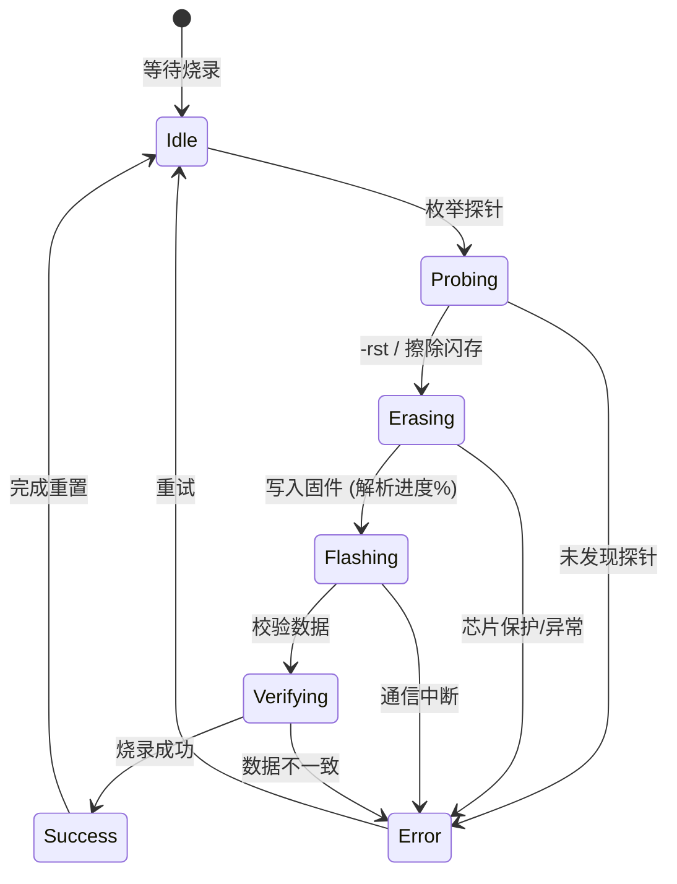
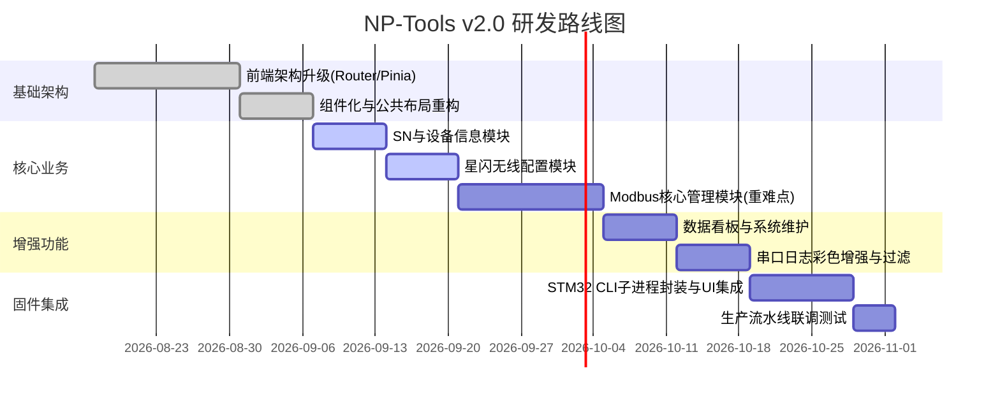

# NP-Tools 硬件产品调试工具 — 软件设计文档 v2.0

## 1. 项目概述

### 1.1 项目背景与定位
- **定位升级**：从通用的串口调试工具升级为公司硬件产品专用的调试工具。
- **扩展性**：保留现有的串口调试功能作为公共基座，在此之上按产品线扩展专属的调试与配置模块。

### 1.2 技术栈
- **前端**：Vue 3 (Composition API), Vite, TypeScript
- **后端**：Tauri v2, Rust (Tokio async, tokio-serial, Actor 模型)
- **工程化**：pnpm monorepo, Cargo workspace

### 1.3 产品线规划
- **数据终端 SJZDV3**（本期重点）
- **控制器**（预留扩展）
- **公共模块**（串口通信、固件烧录）

### 1.4 目标用户
- **现场调试人员**：需要简单、直观、稳定可靠的操作界面。

## 2. 系统架构设计

### 2.1 整体架构
系统采用四层架构设计：UI交互层 → 核心业务逻辑层 → 底层通信适配层 → 硬件设备层。

```mermaid
graph TD
    subgraph UI交互层 [UI交互层 (Vue3 + TS)]
        Router[Vue Router 路由控制]
        Store[Pinia 状态管理]
        Views[视图层 (串口/SJZDV3/烧录)]
        Components[公共组件]
    end

    subgraph 核心业务层 [核心业务逻辑层 (Rust Tauri Commands)]
        DeviceCmd[设备协议指令组装]
        FlashCmd[烧录任务管理]
        SerialCmd[串口连接/配置管理]
    end

    subgraph 通信适配层 [底层通信适配层 (Rust Crates)]
        SerialCore[serial-core Actor模型/批次推送]
        Protocol[device-protocol 编解码器]
        FlashService[flash-service 子进程管理]
    end

    subgraph 硬件设备层 [硬件设备层]
        STM32[STM32F412RET6]
        USART1[USART1 115200 8N1]
    end

    Views --> Router
    Views --> Store
    Views <--> |Tauri IPC| 核心业务层
    
    DeviceCmd --> Protocol
    SerialCmd --> SerialCore
    FlashCmd --> FlashService
    
    Protocol <--> SerialCore
    
    SerialCore <--> |tokio-serial| USART1
    FlashService --> |STM32_Programmer_CLI| STM32
    USART1 <--> STM32
```

### 2.2 前端架构升级
从原有的单文件 `App.vue` 架构升级为现代化前端架构：
- **引入 Vue Router**：按产品线和功能模块组织页面，实现多页面应用的体验。
- **引入 Pinia**：集中式全局状态管理，统一管理串口连接状态、当前设备信息、主题等。
- **组件化拆分**：按功能模块将 UI 拆分为独立的复用组件，提高代码可维护性。

### 2.3 Rust 后端架构
- **serial-core crate**：保持现有的高性能 Actor 模型，维持 33ms/64KB 批次推送和零丢失磁盘录制。
- **device-protocol crate (新增)**：专用于 SJZDV3 及后续设备的协议编解码器，处理严格的定长指令及 `\r\n` 控制符。
- **flash-service crate (新增)**：封装针对 `STM32_Programmer_CLI` 的子进程调用与管理，提供烧录进度反馈。
- **app-types crate**：扩展共享类型，同步前后端的 TS 与 Rust 类型定义。

### 2.4 目录结构规划
```text
np-tools/
├── apps/desktop/src/
│   ├── api/           # Tauri IPC 封装
│   ├── views/         # 页面视图
│   │   ├── SerialView.vue      # 串口调试（原有功能）
│   │   ├── DeviceHomeView.vue  # 设备首页/选择
│   │   └── sjzdv3/             # SJZDV3 专属页面
│   │       ├── ProvisionView.vue   # SN烧录
│   │       ├── SleConfigView.vue   # 星闪配置
│   │       ├── ModbusView.vue      # Modbus点位管理
│   │       ├── DashboardView.vue   # 数据看板
│   │       └── MaintenanceView.vue # 系统维护
│   ├── components/    # 可复用组件
│   ├── composables/   # 组合式函数
│   ├── stores/        # Pinia stores
│   └── router/        # 路由配置
├── crates/
│   ├── serial-core/       # 串口通信引擎（已有）
│   ├── app-types/         # 共享类型（已有，扩展）
│   ├── device-protocol/   # 设备协议编解码（新增）
│   └── flash-service/     # 固件烧录服务（新增）
```

## 3. 导航与布局设计

### 3.1 整体布局
采用现代后台管理系统常见的 **左侧导航栏 + 右侧内容区** 布局：

- **左侧导航栏**（支持折叠，约宽 60px/200px）：
  - **顶部**：应用 Logo + 名称。
  - **中部导航组**：
    - 📡 **串口终端**（公共模块）
    - 🔧 **SJZDV3 数据终端**（产品组，包含下级路由：设备信息 / SN 烧录、星闪配置、Modbus 管理、数据看板、系统维护）
    - 🎮 **控制器**（灰色，预留扩展）
    - 🔥 **固件烧录**（公共模块）
  - **底部**：全局串口连接状态卡片 + 应用设置。
- **右侧内容区**：由 Vue Router 动态渲染的路由视图区。

### 3.2 串口连接状态栏
- **全局共享**：串口连接作为系统的全局公共资源，其状态始终显示在左侧导航栏下方的状态卡片中。
- **状态保持**：建立连接后，所有的产品调试页面共享同一个物理串口通道，切换页面不中断串口通信。

### 3.3 响应式设计
- **最小窗口限制**：800x600，保证主要信息的完整展示。
- **导航栏收缩**：导航栏支持折叠为纯图标模式，释放更多横向空间供数据报表和长指令使用。
- **内容区自适应**：右侧视图容器随窗口尺寸自动缩放和滚动。

## 4. SJZDV3 功能模块设计

### 4.1 设备信息与SN烧录模块
- **功能描述**：用于快速查阅设备的当前运行状态和基本信息，并支持生产环节烧录产品序列号（SN）。
- **指令协议详情**：
  - 发送格式：查询设备信息发送 `DEVINFO\r\n`，烧录SN发送 `SN:4301xxxxxxxx`（不带 `\r\n`，共 15 字节）。
  - 响应格式：
    - 设备信息响应包含：`SN: 4301xxxxxxxx, HW: V1.0, FW: V2.1.3, BOOT: 15, UPTIME: 3600s`
    - SN烧录响应：`OK: SN Written` 或 `ERROR: Invalid SN format`
- **UI交互设计说明**：
  - 页面上部分分为只读的“设备信息卡片”（实时刷新，显示硬件版本、固件版本、开机次数、累计运行时间等）。
  - 下部分为“SN 烧录区域”，提供大尺寸输入框，支持一键清空和格式校验提示。
  - 二次确认弹窗：在点击写入时弹出，防止手滑修改。
- **数据流说明**：前端发出 `query_device_info` 触发后台下发指令，解析器捕获到 `DEVINFO` 响应后更新 Store 状态并反映到 UI。SN 烧录同理，调用独立的 Tauri 指令。

### 4.2 星闪(SLE)无线配置模块
- **功能描述**：用于配置设备的星闪无线通信参数，如网络名称、设备AP ID以及发射功率控制。
- **指令协议详情**：
  - 获取配置：发送 `SLE:LIST\r\n`。工具只在同一 `SLE_CONFIG:BEGIN/EEPROM/CHIP/END` 事务的 ID、payload count 和 CRC32 全部通过后采纳；`END status=ERROR` 仍表示 EEPROM 列表完整，但芯片可能处于非 SLE 模式或未就绪。
  - 修改配置：
    - `SLE_NETNAME:<name>\r\n`（1-15 个可打印 ASCII 字符，16B 存储区保留 NUL）
    - `SLE_APID:<0-255>\r\n`
    - `SLE_PWR:<1-8>`（严禁\r\n，9字节定长）
    - `SLE_MAXPWR:<1-8>`（严禁\r\n，12字节定长）
    - `@WLAN=1/0\r\n`（透传调试开关，必须等待 `SLE_BRIDGE:ACK` 确认实际 UART owner）
- **UI交互设计说明**：
  - 分列对比卡片：左侧展示 EEPROM 期望值，右侧展示芯片实际回读值，如有差异以红色高亮。
  - 表单区域：支持下拉选择功率档位（映射实际dBm），提供滑动条调节 AP ID，一键下发更新。
  - 内嵌 AT 终端视图：开启透传后可直接在此处下发指令调试底层的星闪模块。
- **数据流说明**：UI 先用 `SLE_BRIDGE:LIST` 确认 UART1 由 MCU 处理，再触发 `SLE:LIST`。更新时必须先收到 `SLE_CONFIG:SAVED`，再发起完整 `SLE:LIST` 并比较 revision；开启透传后，工具阻止 MCU 配置命令。芯片运行时状态仍独立于 EEPROM 期望值呈现。

### 4.3 Modbus RTU点位管理模块（重点设计）
- **功能描述**：用于配置网关向下级设备发起的 Modbus 轮询任务表，通过图形化界面取代枯燥的协议字符串拼接。
- **点位字段表格**：

| 字段名 | 描述 | 类型 | 范围 | 默认值 |
|---|---|---|---|---|
| 从站地址 | Modbus从设备地址 | Integer | 1-247 | 1 |
| 功能码 | 支持的操作代码 | Integer | 1, 2, 3, 4 | 3 |
| PLC寄存器地址| 寄存器偏置地址 | Integer | 1-65535 | 1 |
| 读取长度 | 需读取的寄存器个数 | Integer | 1-31 | 1 |
| 数据类型 | 提取后的解析类型 | Enum | 0-6 | 1 (INT16) |
| 字节序 | 数据的拼装字节顺序 | Enum | 0-3 | 0 (ABCD) |

- **数据类型枚举表**：
  - 0: `RAW_HEX`
  - 1: `INT16`
  - 2: `UINT16`
  - 3: `INT32`
  - 4: `UINT32`
  - 5: `FLOAT32`
  - 6: `BOOL`

- **字节序枚举表**（适用于 32 位数据）：
  - 0: `ABCD` (大端)
  - 1: `CDAB` (字交换，小端)
  - 2: `BADC` (字节交换)
  - 3: `DCBA` (小端)

- **指令协议详情与编码格式**：
  - **下发格式**：`RS485DEV:<points>\r\n`
  - **点位拼接**：单个点位格式为 `从站地址,功能码,PLC寄存器地址,读取长度,数据类型,字节序`。多点位之间用分号 `;` 分隔。
  - *示例*：`RS485DEV:1,3,40001,2,5,0;2,4,40002,1,2,0\r\n`
  - **单点调试**：`RS485DEV:DEBUG:从站,功能码,PLC地址,长度\r\n`
  - **清空列表**：`RS485DEV:RESET\r\n`
  - **回读列表**：`RS485DEV:LIST\r\n`

- **智能联动纠错规则**：
  - 当“数据类型”选择 32位数据（INT32/UINT32/FLOAT32）时，自动将“读取长度”修正为最小2，并禁用 1 的选项。
  - 功能码 1 或 2，自动约束数据类型仅可选 BOOL 或 RAW_HEX。
  - 寄存器地址如果超过当前从机最大范围则飘红警告。

- **导入导出模板格式**：
  - 导出 CSV 格式包含表头：`Slave_ID,Function_Code,Register,Length,Data_Type,Byte_Order`
  - 导出 JSON 支持整个任务对象的备份。

- **UI wireframe描述**：
  - **工具栏**：包含刷新回读、清空列表（带二次确认弹窗）、添加点位、从文件导入、导出至文件、批量下发。
  - **Data Grid 表格**：最大支持 100 行，与 SJZDV3 固件 `MODBUS_DEV_MAX_NUM` 保持一致；支持行内点击直接编辑数字，类型和功能码为下拉菜单。
  - **操作列**：包含拖拽调整顺序的手柄图标、单行调试按钮（弹出抽屉显示该点位的单次读取十六进制及解析结果）、删除按钮。

- **数据流说明**：前端表格维护完整数组，最多 100 点；批量下发前 Rust 层校验点位及 UART1 2048B 上限。下发后必须先等待 `RS485_CONFIG:SAVED`，再执行 `RS485DEV:LIST`，且仅在 `RS485_CONFIG:BEGIN/POINT/END` 的事务 ID、count、CRC32 和 revision 复核通过后更新表格。单点调试只接受同一 ID 的 `MB_DEBUG:BEGIN/TX/RX/DATA/RESULT/END`。

### 4.4 数据看板与硬件监测模块
- **功能描述**：用于实时查看设备的模拟量输入和指示灯状态，方便现场接线排查。
- **指令协议详情**：
  - 开始连续上报：`AITEST\r\n` (1Hz频率自动上报)
  - 停止上报：`TESTSTOP\r\n`
  - 上报数据：`AI_DATA: CH1=12.5mA, CH2=4.1mA`
  - LED测试：`ALLGREEN\r\n`, `ALLRED\r\n`, `ALLOFF\r\n`
- **UI交互设计说明**：
  - 顶部并排显示双路 4-20mA 数值的实时大型仪表盘卡片。
  - 下方嵌入 ECharts 实时动态折线图，X 轴为时间，Y 轴为电流值。
  - 侧边栏提供控制面板，点击按钮可强制覆盖设备 LED 灯色用于物理定位确认。
- **数据流说明**：进入视图的 `onMounted` 钩子发出 `AITEST`，启动数据流订阅；`onUnmounted` 必须触发 `TESTSTOP` 节约系统资源。

### 4.5 系统维护模块
- **功能描述**：用于高级维护操作、恢复出厂设置及日志管理。
- **指令协议详情**：
  - 上报周期：`RTFRE:<1-255>\r\n`（分钟）
  - 日志等级：`LOGLEVEL:<0-5>\r\n`（0关闭，5最高）
  - 系统软复位：`@RST\r\n`（系统重启）
  - 清空设备：`@POC=0\r\n`，`@RTM=0\r\n`，`@EEP=0\r\n`（极高危）
- **UI交互设计说明**：
  - 划分为基础设置和高危操作区。高危区背景带淡红色警告，点击 `@EEP=0` 弹出带倒计时（5秒）的确认框并要求手动输入 `CONFIRM`。
- **数据流说明**：直接下发指令并根据设备回传日志判断重启成功。

## 5. 通信协议与指令编码规范

所有指令下发需要遵从如下规范，底层 Rust 解析器将根据配置决定是否拼接终止符及验证数据长度。超时机制默认 800ms，异步等待。

| 指令 | 格式模板 | 是否带 \r\n | 长度约束 | 固件解析要求 |
|---|---|---|---|---|
| SN | `SN:4301xxxxxxxx` | 否 | 严格 15 字节 | 不带回车换行，否则解析失败 |
| SLE_NETNAME | `SLE_NETNAME:<name>` | 是 | 1-15 个可打印 ASCII 字符 | 16B 存储区保留 NUL，超限拒绝 |
| SLE_APID | `SLE_APID:<0-255>` | 是 | 最长 12 字节 | 纯数字解析 |
| SLE_PWR | `SLE_PWR:<1-8>` | 否 | 严格 9 字节 | 定长接收，杜绝缓冲区溢出 |
| SLE_MAXPWR| `SLE_MAXPWR:<1-8>` | 否 | 严格 12 字节 | 定长接收 |
| SLE:LIST | `SLE:LIST` | 是 | 固定 | 用于读取 |
| RS485DEV:* | `RS485DEV:<points>` | 是 | 变长 | 多点位分号解析 |
| AITEST | `AITEST` | 是 | 固定 | 进入调试流模式 |
| TESTSTOP | `TESTSTOP` | 是 | 固定 | 退出调试流 |
| ALLGREEN | `ALLGREEN` | 是 | 固定 | - |
| ALLRED | `ALLRED` | 是 | 固定 | - |
| ALLOFF | `ALLOFF` | 是 | 固定 | - |
| RTFRE | `RTFRE:<1-255>` | 是 | 固定 | - |
| LOGLEVEL | `LOGLEVEL:<0-5>` | 是 | 固定 | 立即生效控制 stdout 输出 |
| @WLAN | `@WLAN=1/0` | 是 | 固定 | 切换透传网关模式 |
| DEVINFO | `DEVINFO` | 是 | 固定 | - |
| @POC | `@POC=0` | 是 | 固定 | - |
| @RTM | `@RTM=0` | 是 | 固定 | - |
| @RST | `@RST` | 是 | 固定 | MCU软复位 |
| @EEP | `@EEP=0` | 是 | 固定 | EEPROM全量擦除（高危） |

## 6. 固件烧录集成设计

### 6.1 概述
将 STM32 固件烧录工具（STM32CubeProgrammer CLI）集成到桌面工具中，消除外部工具依赖体验。

### 6.2 烧录状态机设计
烧录状态流转如下：



### 6.3 Rust flash-service crate 设计
- **公开 API**：提供 `probe_devices()`，`start_flash(file_path)`，`cancel_flash()`。
- **进度回调类型 (Events)**：`FlashProgress { state: String, percent: u8, message: String }` 通过 Tauri Event 推送到前端。
- **错误类型**：`FlashError::ProbeFailed`, `FlashError::BinInvalid`, `FlashError::ProcessKilled`, `FlashError::VerifyFailed`。

### 6.4 stdout 解析规则
通过捕获 STM32_Programmer_CLI 的标准输出进行正则匹配：
- **百分比提取**：`Downloading\s+\[.*?\]\s+(\d+)%`
- **完成识别**：`File download complete` 或 `Download verified successfully`
- **错误识别**：匹配包含 `Error:` 的行即置为异常退出。

### 6.5 工具链探测与可行性评估
- 自动探测安装路径：
  - macOS: `~/Library/Application Support/stm32cube/bundles/programmer/*/bin/`
  - Windows: `C:\Program Files\STMicroelectronics\STM32Cube\STM32CubeProgrammer\bin\`
- **可行性评估**：高度可行。通过子进程调用成熟的原厂 CLI 工具规避了直接实现 SWD 协议的高昂成本，仅需保证正确安装依赖，是业界通用的性价比方案。

### 6.6 一键生产流水线（可选）
可整合为连续工作流：SWD 固件烧录 → 串口尝试连接 → 成功后自动向串口发送 SN 写入指令 → 通过 `DEVINFO` 校验最终生产状态，实现工厂人员“一键双工位”傻瓜式操作。

## 7. 串口监视器增强设计

### 7.1 ANSI彩色解析规则
设备输出的调试日志采用 ANSI 转义序列包含颜色信息。前端通过 Xterm.js 或自研解析组件，实现对以下规则的拦截与上色：
- **绿色（DBGI）**：`\x1b[32m` (INFO 级别)
- **黄色（DBGW）**：`\x1b[33m` (WARN 级别)
- **红色（DBGE）**：`\x1b[31m` (ERROR 级别)
- **恢复默认**：`\x1b[0m`

### 7.2 日志过滤器设计
- 增加快速过滤按钮，通过正则匹配日志头部标志位（如 `[INFO]`, `[WARN]`, `[SLE_PACKET]`）。
- 支持多条件高亮（例如搜索特定寄存器地址的报文），帮助排查底层通讯问题。

### 7.3 其他增强
- 记录导出：支持将原始文本（剔除或保留 ANSI 码可选）存入 `.log` 文件。
- 自定义快捷指令：允许用户保存常用测试串并在侧边栏快捷发送。

## 8. 实施路线图



**每阶段交付物**：
- **阶段一**：重构完成的基础壳工程结构，可独立运行多路由。
- **阶段二**：完成 SJZDV3 主配置功能，实现点位的高效编排和错误拦截。
- **阶段三**：提供直观的实时数据流和排错工具。
- **阶段四**：交付内嵌固件烧录的全套免安装外围组件工具链。
- **阶段五**：全量回归测试报告，发布 macOS/Windows 双平台独立可执行文件包。
